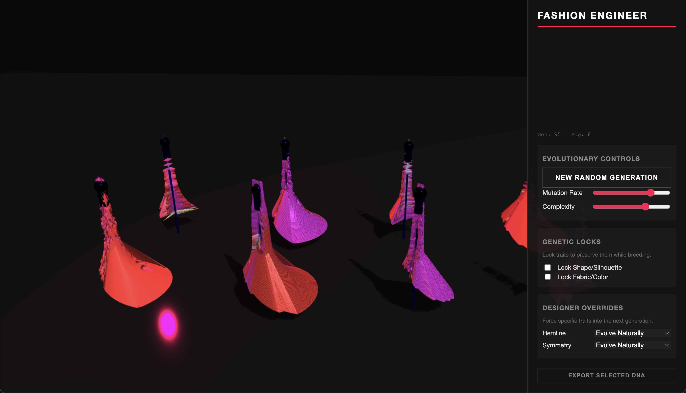

# AblOEh

*An evolutionary fashion design platform combining Open-Endedness with Virgil Abloh's design ethos*

## Overview

AblOEh is an interactive evolutionary design tool that uses Compositional Pattern Producing Networks (CPPNs) to generate and evolve dress designs. Click on any design to breed from it, creating a new generation of mutated offspring. The system combines neural network-based pattern generation with explicit fashion traits, allowing exploration of vast design spaces through artificial selection.

## How It Works

### Compositional Pattern Producing Networks (CPPNs)

The system uses neural networks to generate dress patterns. Each dress has a CPPN that takes spatial coordinates as input and outputs colors and surface details.

**Network Structure:**
- **Inputs:** Angular position, height, radius, and bias
- **Outputs:** RGB color, surface displacement, alpha (transparency/cutouts)
- **Hidden layers:** Evolve through mutations
- **Activation functions:** Sin, Cos, Tanh, Abs, Gaussian, Step, Sawtooth, Sigmoid

The CPPN approach produces complex patterns from simple networks by composing mathematical functions, allowing organic textures and symmetries to emerge naturally.

### Genetic Encoding

Each dress has two types of genes:

1. **Explicit Traits:** Direct parameters for fashion elements
   - Skirt length (mini to floor-length)
   - Waist width
   - Skirt flare
   - Shoulder width
   - Neckline depth
   - Hem asymmetry
   - Ruffle amplitude

2. **CPPN Network:** Topology and weights
   - Number of nodes and connections
   - Connection weights
   - Activation functions

This dual encoding gives you control over both high-level silhouette and fine-grained texture/color details.

### Evolution

**Mutation** is the primary way designs change:
- Trait mutation: Small random changes to explicit parameters
- Weight mutation: Changes to network connection weights
- Structural mutation: Adding nodes and connections (controlled by complexity parameter)
- Function mutation: Swapping activation functions

**Selection:** You choose which design to breed from by clicking on it. The population of 8 designs (2×4 grid) all descend from your selection.

**Genetic Locks:** Optional constraints to preserve specific aspects:
- Shape/silhouette lock
- Fabric/color pattern lock

This lets you evolve one aspect while keeping another constant.

### Rendering

The system converts genetic information into 3D meshes:

1. Creates a cylindrical base form with trait-dependent dimensions
2. Queries the CPPN at each vertex for color and displacement
3. Builds the geometry (64 radial × 32 vertical segments)
4. Applies surface displacement along normals
5. Renders with Three.js WebGL

Each dress is displayed on a mannequin with real-time lighting and shadows.

## Features

### Controls

**Evolutionary:**
- **New Random Generation:** Start fresh with 8 random designs
- **Mutation Rate:** Controls how much designs change (0.1-1.0)
- **Complexity:** Governs network growth (0-10)

**Genetic Locks:**
- Lock shape/silhouette
- Lock fabric/color pattern

**Designer Overrides:**
- Force specific hemlines (mini/maxi/asymmetric)
- Force symmetry level (high/low)

### Interaction

- **Left click + drag:** Rotate camera
- **Right click + drag:** Pan camera
- **Scroll:** Zoom
- **Click on dress:** Breed from that design (creates 8 mutated children)

## Technical Details

- **Rendering:** Three.js r128 (WebGL)
- **Camera:** OrbitControls
- **Language:** Vanilla JavaScript
- **Activation Functions:** 8 mathematical functions (sin, cos, tanh, abs, gaussian, step, sawtooth, sigmoid)
- **Population:** 8 designs per generation (2×4 grid)
- **Mesh Resolution:** 64 radial × 32 vertical segments

## Usage

1. Open `v3.html` in a modern browser
2. 8 random designs appear automatically
3. Click any dress to breed from it
4. Adjust mutation rate and complexity as desired
5. Use locks to preserve shape or color while evolving the other
6. Use overrides to force specific features

## Inspiration

Inspired by Kenneth Stanley's Picbreeder and the design philosophy of Virgil Abloh. The name "AblOEh" combines open-endedness with Abloh's innovative approach to fashion design.

## References

- Stanley, K. O. (2007). Compositional pattern producing networks: A novel abstraction of development. *Genetic Programming and Evolvable Machines*, 8(2), 131-162.
- Secretan, J., et al. (2008). Picbreeder: evolving pictures collaboratively online. *CHI '08*.